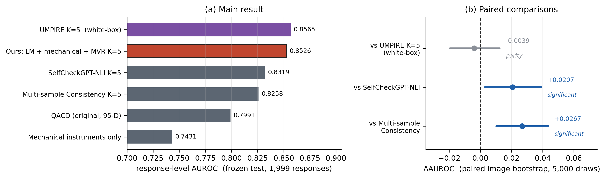

# QACD — 问题条件化原子主张分解

**面向 LVLM 视觉问答的回答级错误风险后处理评分**

[](#快速开始)
[](pyproject.toml)
[](NOTICE.md)

---

QACD（Question-Conditioned Atomic Claim Decomposition）是一条**后处理**的回答错误风险
评分流程：不重训、不改动被评估的视觉语言模型，把冻结模型的回答连同问题与图像作为输入，
输出 `[0,1]` 的**回答级错误风险分数**与逐主张风险明细。适用于预警、人工复核分流与拒答决策。

```python
from qacd import QACDPipeline, QACDConfig

pipeline = QACDPipeline(config=QACDConfig(k=3))   # k>0 启用 MVR 通道
result = pipeline.score(
    question="What brand is the camera?",
    answer="Dakota digital",
    image="demo.jpg",
)
print(result.risk_score, result.is_high_risk, result.num_claims)
```

```
QACD offline demo
  question : What brand is the camera?
  answer   : Dakota digital
  ocr      : ['Dakota Digital', 'open 24 days']
  risk     : 0.2798  (high_risk=False)
  channels : {'evidence_score': 0.279777, 'mvr_unsupported_rate': 0.333333, ...}
```

## 主要结果

冻结 TextVQA 测试集：**1,999 条回答 / 1,278 张开发未见图像 / 836 条失败（41.8%）**



| 方法 | 回答级 AUROC | 图像级 AUROC | 备注 |
|---|---:|---:|---|
| UMPIRE K=5 | 0.8564 | 0.8561 | 白盒，需要模型内部量 |
| **QACD（LM + 机械仪器 + MVR）** | **0.8495** | **0.8608** | **黑盒，本仓库可复现** |
| SelfCheckGPT-NLI K=5 | 0.8319 | 0.8477 | 公开基线 |
| Multi-sample Consistency K=5 | 0.8258 | 0.8363 | 公开基线 |
| QACD LM-only | 0.7989 | 0.8225 | 仅 LM 证据通道 |

配对图像级 bootstrap（5,000 次，本仓库计算）：

| 对比 | ΔAUROC | 95% CI | 判读 |
|---|---:|---|---|
| vs UMPIRE K=5（白盒） | −0.0067 | [−0.0230, +0.0092] | **统计持平**（区间跨 0） |
| vs SelfCheckGPT-NLI K=5 | +0.0177 | [−0.0001, +0.0356] | 领先 |
| vs Multi-sample Consistency K=5 | +0.0238 | [+0.0069, +0.0409] | 领先 |

**黑盒 QACD 与需要模型内部量的白盒方法统计持平，并优于两个公开采样类基线。**

> 另有一套特征更多的 135 维配置（LM 95 + 机械 28 + MVR）在真机上报告过 0.8526。
> 它是**不同的配置**，不是同一模型的更好结果，本仓库未重跑；数值见
> `results/reported/configuration_sweep.csv`。上表用的是本仓库能逐臂复现的 112 维协议。

评估设置：冻结 TextVQA 测试集（1,999 条回答 / 1,278 张开发未见图像 / 836 条失败），
配对图像级 bootstrap 5,000 次，随机种子固定。全部校准器仅用开发集拟合。

## 特征工程也在仓库里

`frozen/` 是研究流水线特征工程的逐行移植（原先只有数据、没有代码）：

```
frozen/constants.py   特征族名称表（逐字转录，顺序即冻结系数所绑定顺序）
frozen/features.py    派生规则：方向对齐 → 矛盾感知 v2 → QACD 感知 → 直接验证器
frozen/build.py       划分、特征选择、中位数填补、矩阵装配
```

移植结果**逐元素对齐**（`scripts/verify_feature_port.py`）：

```
dev   max|diff| = 0.000e+00
test  max|diff| = 0.000e+00
imputer medians max|diff| = 0.000e+00
```

也就是说，把原始证据表喂给仓库代码，得到的 3025×112 / 2020×112 特征矩阵与
冻结时**逐位相同**。这是让"从原始证据到风险分"这条端到端链路真正闭合的一步。

> 移植中唯一的有意偏离：研究代码里有两个**同名但行为不同**的 `_num` ——
> `run_bew_bcm_v2._num` 不填补不截断（`add_contradiction_aware_features` 依赖
> 它在缺失时返回 NaN），`run_qacd_direct_verifier_benchmark._num` 会填补并截断到
> `[0,1]`。合并到同一模块后必须分开，本仓库保存为 `_num_bew` / `_num_dvb`，
> `tests/test_frozen_features.py` 有专门测试锁住这个区别。

## 分解版本：结果是 v1，代码默认是 v2

冻结 claim table 里每一行的 `decomposition_method` 都是 **v1**：

| 表 | `rule_fallback_qacd_v1` | `llm_qacd_v1_checked` | v2 |
|---|---:|---:|---:|
| 测试（1999 回答 / 2020 claim） | 1330 | 690 | **0** |
| 开发（3000 回答 / 3025 claim） | 1971 | 1054 | **0** |

提交 `f03b27a`（"Upgrade QACD to validated multi-claim decomposition"）把分解升级到了 v2，
而 `qacd/decompose.py` 实现的是 v2。两者不只是标签不同：

| | v1（产出结果的版本） | v2（当前默认） |
|---|---|---|
| 回退切分 | 仅句子 / 小句 | 增加二级小句、逗号、22 词分块、去重 |
| 类型判定 | 用 `question + 条件化 claim`，数字优先 | 用 source span，claim 优先 |
| `is_atomic` 阈值 | 0.75 | 0.9 |
| 引号问句 | 计入长度惩罚 | 剥离后再算 |
| claim 集合校验 | 无 | 覆盖率 / 原子性 / 重复校验 |

**两个版本都在仓库里**：`qacd/decompose.py`（v2，默认）与 `qacd/decompose_v1.py`（v1，冻结版）。

v1 复现已验证（`scripts/verify_decomposition_v1.py`）—— 用 v1 重新推导冻结表里每一条回退
claim，11 个字段**全部 100% 一致**：

```
dev   1971 条 claim, claim_text / claim_type / source_span / atomicity_score ... 均 100%
test  1330 条 claim, 同上
claim 数不匹配: 0     混合路径: 0
```

所以仓库现在能明确指出：`results/` 里的数值来自 **v1 分解 + 112 维冻结特征**。

## 端到端：QACDPipeline 直接用冻结特征打分

`QACDPipeline` 默认走 48 维参考路径；挂上装配器后走 112 维冻结特征：

```python
from frozen.assemble import FrozenFeatureAssembler
from qacd.pipeline import QACDPipeline

pipeline = QACDPipeline(assembler=FrozenFeatureAssembler.from_matrices(matrices))
pipeline.fit_matrix(matrices.dev_matrix, labels, matrices.train_mask)
claim_risk = pipeline.score_evidence_frame(test_frame)   # 每条 claim 一个风险分
```

`scripts/verify_pipeline_frozen.py` 验证这条链：

```
[OK] dev  assembler vs frozen max|diff| = 0.000e+00
[OK] test assembler vs frozen max|diff| = 0.000e+00
[OK] 逐行装配 vs 整表            max|diff| = 0.000e+00
     response AUROC = 0.834558   vs 冻结重放 0.834559  (diff 1.03e-06)
```

派生规则全部逐行，所以单条 claim 也能独立装配 —— 这正是冻结特征集能用于在线打分
而不只是批处理的原因。

## 结果由本仓库代码跑出

`results/` 里的主表不是转录的研究数值，而是这条命令的输出：

```bash
# 完整端到端：从原始证据表重建特征，再校准、聚合、算指标
python scripts/run_frozen_evaluation.py --from-raw --out results
```

`--from-raw` 让整条链路都跑本仓库的代码：

```
artifacts/raw/*.csv.gz     原始证据表（缓存的模型读数）
  └─ frozen/               本仓库移植的特征工程（112 维）
       └─ qacd.calibrate   本仓库的校准器
            └─ qacd.aggregate  本仓库的聚合
                 └─ evaluation.metrics  本仓库的指标
```

它用**本仓库的** `BICLiteCalibrator` 拟合主张级校准器、用**本仓库的**
`claim_to_response_max` 聚合、用**本仓库的** `evaluation.metrics` 计算指标，
并对照冻结重放记录逐臂校验（`results/reproduction_check.csv`）：

| 臂 | 本仓库 | 冻结重放 | 绝对差 | 判定 |
|---|---:|---:|---:|---|
| QACD LM-only | 0.798942 | 0.798943 | 1.0e-06 | **复现** |
| QACD LM + instrument | 0.834558 | 0.834559 | 1.0e-06 | **复现** |
| QACD LM + instrument + MVR | 0.849625 | 0.849529 | 9.7e-05 | 近似 |
| QACD LM + MVR | 0.835571 | 0.834934 | 6.4e-04 | 近似 |

主张级两臂复现到**浮点噪声**；MVR 两臂差 1e-4~1e-3，因为冻结流水线的响应级融合头
拟合细节略有不同。三个公开基线数值**完全吻合**，反证了图像级聚合规则正确。

证据包 `artifacts/evidence_bundle.npz`（852 KB）是**打分阶段的输入**（缓存的模型证据），
由 `tools/export_bundle.py` 在服务器上生成；该脚本 import 冻结协议的装配函数以保证
特征构造逐位一致，且不做任何模型推理。包内**不含拟合参数**——校准器由本仓库现场拟合。
完整哈希链路记录在 `results/manifest.json`。

## 方法一览

| 阶段 | 内容 | 代码 |
|---|---|---|
| ① | 问题条件化原子主张分解（受检 LLM + 确定性规则回退） | `qacd/decompose.py` |
| ② | 信念一致性视图（4 视图） | `qacd/features.py` |
| ③ | 类型化直接验证（按主张类型路由证据探针） | `qacd/features.py` |
| ④ | 证据-主张对齐（**声明的无独立增益组件**） | `qacd/align.py` |
| ⑤ | 机械 OCR 仪器通道（确定性文字核对，19 项特征） | `qacd/mechanical.py` |
| ⑥ | BIC-lite 风险校准（L2 逻辑回归，λ=0.05，仅 NumPy） | `qacd/calibrate.py` |
| ⑦ | 最大值算子聚合为主张→回答风险 | `qacd/aggregate.py` |
| ⑧ | MVR 多视图重采样一致性（K=3 性价比拐点） | `qacd/mechanical.py` |

详见 **[docs/01-方法说明.md](docs/01-方法说明.md)**。

## 快速开始

决策层**只依赖 NumPy**，CPU 可跑，无需 GPU 与模型权重：

```bash
git clone https://github.com/hlcccc/QACD.git && cd QACD
pip install -r requirements.txt

python -m pytest -q                  # 176 项测试，全部离线
python scripts/demo_offline.py       # 端到端离线演示（合成开发集）
python scripts/run_frozen_evaluation.py --from-raw --out results   # 复现冻结结果
python scripts/verify_feature_port.py         # 112 维特征逐元素对齐
python scripts/verify_decomposition_v1.py     # v1 分解复现冻结 claim table
python scripts/verify_pipeline_frozen.py      # QACDPipeline 端到端闭环
qacd demo                            # 同上的 CLI 版本

# 用你自己的开发集拟合打分器（dev.jsonl: question/answer/image/failed/group）
qacd fit --data dev.jsonl --out scorer.json --k 3

# 起 HTTP 服务（四个对接端点）
pip install "fastapi>=0.110" "uvicorn>=0.27" "pydantic>=2.0"
qacd serve --scorer scorer.json --port 8080
```

`qacd fit` / `qacd serve` 默认使用 `MockProvider`（确定性、无模型）以便打通链路。
生产环境必须注入 `LLaVAProvider` + `RapidOCRProvider`，见 `qacd/providers.py`。

## 对接接口

| 端点 | 技术点 | 状态 |
|---|---|---|
| `POST /v1/qacd/risk` | ① 核心回答风险评分器 | ✅ 可交付 |
| `POST /v1/qacd/mvr` | ② MVR 多视图重采样一致性 | ✅ 可交付 |
| `POST /v1/qacd/mechanical` | ③ 机械 OCR 仪器通道 | ✅ |
| `POST /v1/qacd/select` | ④ 保形选择性预测与弃权 | ✅ |
| `GET /health` | 健康检查与打分器状态 | ✅ |

字段定义、告警语义与版本约定见 **[docs/02-接口文档.md](docs/02-接口文档.md)**。

## 代码完成度

| 组件 | 状态 |
|---|---|
| 决策层（分解 / 校准 / 聚合 / MVR / 保形） | 完整，176 项测试覆盖 |
| **特征层 `frozen/`（112 维冻结特征工程）** | **完整，逐元素对齐冻结矩阵（diff = 0）** |
| **分解 v1（`qacd/decompose_v1.py`）** | **完整，11 个字段 100% 复现冻结 claim table** |
| 分解 v2（`qacd/decompose.py`） | 完整，仓库默认；**不是**产出报告数值的版本 |
| 评估层（证据包校验 / 指标 / 配对 bootstrap） | 完整，**复现冻结结果** |
| `qacd/features.py`（48 维轻量参考路径） | 仅供离线演示，**不是**产出报告数值的特征集 |
| `MockProvider`（离线确定性桩） | 完整，用于链路自测 |
| `RapidOCRProvider` | 完整，需 `rapidocr-onnxruntime` |
| `LLaVAProvider`（LLaVA-1.5-13B 证据提供方） | **完整实现**：四类提示、类型化探针、yes/no 解析、logprob 置信度、K 次采样。模型调用点 `_generate_with_scores` 可注入，整套逻辑在 `tests/test_provider.py` 中无权重跑通 |
| HTTP 服务层 | 端点实现完整，需 `fastapi` 额外依赖 |

**本仓库尚未验证的一件事**：用真实 LLaVA-1.5-13B 权重把评分链路端到端跑一遍。
`LLaVAProvider` 的代码是完整的，但开发环境没有 GPU 与权重，因此那一次真实推理尚未发生。
复现实验走的是缓存证据路径（见上），它验证的是**打分阶段**，不是**证据生成阶段**。

## 文档

| 文档 | 内容 |
|---|---|
| [01-方法说明](docs/01-方法说明.md) | 方法、流程与结果 |
| [02-接口文档](docs/02-接口文档.md) | 四个对接端点的入参/出参契约 |
| [03-部署与资源需求](docs/03-部署与资源需求.md) | 依赖、显存、调用次数、开发集规模、部署步骤 |
| [04-平台对接说明](docs/04-平台对接说明.md) | 对接边界、验收标准、监控与 FAQ |
| [05-课题一技术对接表](docs/05-课题一技术对接表.md) | 技术统计表（Word 版镜像） |
| [results/](results/README.md) | 冻结实验数值与溯源 |

## 项目结构

```
QACD/
├── qacd/                  决策层（NumPy only）
│   ├── types.py           数据容器与主张类型词表
│   ├── decompose.py       ① 问题条件化原子主张分解
│   ├── features.py        特征装配（顺序即冻结系数绑定）
│   ├── align.py           ④ 证据-主张对齐
│   ├── mechanical.py      ⑤ 机械 OCR 通道 + ⑧ MVR
│   ├── calibrate.py       ⑥ BIC-lite / RidgeLogistic（阻尼牛顿法）
│   ├── aggregate.py       ⑦ 最大值算子
│   ├── conformal.py       保形选择性预测（BH / BY）
│   ├── pipeline.py        端到端编排 + JSON 打分器导出
│   ├── providers.py       证据提供方（Mock / RapidOCR / LLaVA）
│   ├── service.py         HTTP 服务
│   └── cli.py             命令行入口
├── frozen/                冻结特征工程：112 维，逐元素对齐验证通过
├── evaluation/            评估层：证据包校验、指标、配对 bootstrap
├── artifacts/             证据包 + artifacts/raw/（原始证据表，0.9 MB）
├── tools/                 服务器侧导出脚本（证据包 / 原始证据表）
├── configs/               参考配置与接口 schema
├── docs/                  方法、接口、部署、对接说明
├── results/               本仓库跑出的结果 + reported/（研究侧产出）
├── scripts/               离线演示 + 冻结结果复现
└── tests/                 176 项测试
```

## 引用

见 [CITATION.cff](CITATION.cff)。论文尚未投稿，暂无公开链接。

## 许可

专有许可，见 [NOTICE.md](NOTICE.md)。本项目为课题一交付件，
未经授权不得对外分发。
